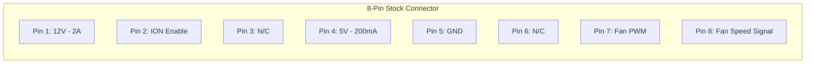
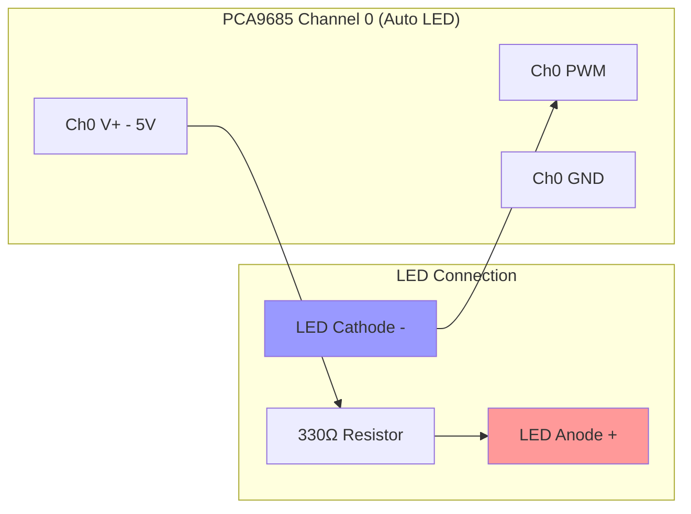

# Winix WAC6300/WAC5500 Smart Air Purifier Retrofit

Transform your Winix WAC6300 or WAC5500 air purifier into a smart home device with full Home Assistant integration while maintaining all original functionality.

> [!WARNING]
> This is a WORK IN PROGRESS


## ⚠️ SAFETY WARNING ⚠️

**HIGH VOLTAGE HAZARD - RISK OF DEATH OR SERIOUS INJURY**

The Winix WAC6300/WAC5500 power supply contains:
- **330VDC** for the fan motor
- **120VAC** mains voltage
- High voltage capacitors that may retain charge even when unplugged

### Safety Precautions:
- **ALWAYS UNPLUG** the unit and wait 10 minutes before working on it
- **NEVER** open or modify the power supply module
- **ONLY** work on the control PCB replacement as described
- The 8-pin connector carries only 5V and 12V, but the cable comes from the high voltage power supply, handle with care
- Keep the power supply module closed, it contains lethal voltages
- Use insulated tools
- Never work on the device while powered
- If you're not comfortable working near high voltage equipment, seek professional help

**This modification involves working near high voltage components. Improper handling can result in electric shock, fire, or death. Proceed at your own risk.**

## Features

### 🏠 Smart Home Integration
- **Full Home Assistant control** via ESPHome
- WiFi / Thread connectivity
- Real-time status monitoring and control
- Filter life tracking with notifications

### 🎛️ Original Functions Preserved
- All 4 original fan speeds (20%, 28%, 38%, 54%)
- Mode button with speed cycling
- Power button with on/off control
- Filter reset functionality
- Ionizer control
- All LED indicators

### ✨ Enhanced Features
- **Smart Power Button**: Always turns on to last used speed (never just "off")
- **Long Press Controls**: 
  - Power button: Dim/restore all LEDs
  - Mode button: Toggle ionizer
  - Filter reset: Reset both filter timers with visual feedback
- **Sleep Mode**: Automatically dims LEDs to 25% brightness
- **Filter Tracking**: 
  - Carbon filter: 90-day lifetime
  - HEPA filter: 365-day lifetime
  - Automatic notifications when replacement needed
- **Progressive Speed LEDs**: Visual indication shows current speed level
- **Custom Speed Control**: Set any speed from 0-100% via Home Assistant

### 🚧 Features Not Yet Implemented
The following features from the original Winix units are not currently implemented in this retrofit but are planned for future development:

- **Buzzer/Beeper**: Audio feedback for button presses and alerts
- **IR Remote Receiver**: Support for the original infrared remote control
- **Air Quality Filter**: Automatic fan speed adjustment based on air quality sensors

These features may be added in future versions of the project.

## Compatibility

This retrofit has been tested and confirmed to work with the following Winix air purifier models:

- **WAC6300** - 4-speed air purifier with ionizer
- **WAC5500** - 4-speed air purifier with ionizer  
- **WAC5500-2** - 4-speed air purifier with ionizer (variant model)

All models share the same basic internal connector pinout and power supply configuration, making them compatible with this retrofit design.

### Model Differences

**WAC6300 and WAC5500 (Standard Models)**
- Share identical electronics and connector configuration
- 12V power supply on Pin 1 of connector
- Standard PWM ranges and ionizer control

**WAC5500-2 (Variant Model)**
- **Different PWM Frequency**: Operates at 2000.5 kHz (instead of standard 3.910 kHz)
- **Modified Ionizer Control**: Pin 1 carries 4.723V DC (instead of 12V) and controls the ionizer feature directly
- **Different PWM Ranges**:
  - Sleep Mode: 14% (vs 10% on standard models)
  - Speed 1: 17% (vs 20% on standard models)
  - Speed 2: 19% (vs 28% on standard models)
  - Speed 3: 21% (vs 38% on standard models)
  - Speed 4 (Turbo): 33% (vs 54% on standard models)

**Configuration Notes for WAC5500-2**
All PWM speeds and frequency can be adjusted through the Home Assistant interface to match your specific model requirements. The default configuration targets the standard WAC6300/WAC5500 models, but users with the WAC5500-2 variant can easily adjust the values in the config category within Home Assistant without needing to reflash firmware.

## Technical Specifications

### Version Information
- **Version**: 1.0
- **Last Updated**: January 2025
- **Platform**: ESP32-C6 with ESPHome

### Hardware Requirements

- **Microcontroller**: Seeed Xiao ESP32-C6 module
- **PWM Controller**: PCA9685 16-channel PWM controller (I2C address 0x40)
- **PWM Frequency**: 1kHz for LED control
- **Power Requirements**: 
  - 5V from stock connector (Pin 4) - 200mA (insufficient for ESP32 + accessories)
  - 12V from stock connector (Pin 1) - 2A (primary power source)
  - 3.3V generated on-board for ESP32 and logic
  - **12V to 5V Buck Converter** - Required due to insufficient current from stock 5V rail
- **Additional Components**:
  - 12V to 5V buck converter (e.g., LM2596 module, 3A+ rating recommended)
  - PCA9685 board with built-in current limiting resistors

## Wiring Diagram

### Stock Connector Pinout


### ESP32-C6 Connections

```mermaid
graph TB
    subgraph "Seeed Xiao ESP32-C6"
        ESP_3V3[3.3V Power]
        ESP_5V[5V Power]
        ESP_GND[GND]
        GPIO0[GPIO0 - Fan Feedback ADC]
        GPIO1[GPIO1 - Fan PWM Out]
        GPIO2[GPIO2 - PCA9685 OE]
        GPIO18[GPIO18 - Mode Button]
        GPIO19[GPIO19 - Power Button]
        GPIO20[GPIO20 - Filter Reset Button]
        GPIO21[GPIO21 - ION Enable]
        GPIO22[GPIO22 - I2C SDA]
        GPIO23[GPIO23 - I2C SCL]
    end
    
    
    subgraph "Stock Connector"
        SC1[Pin 1: 12V - 2A]
        SC2[Pin 2: ION Enable - 3.3V Safe]
        SC4[Pin 4: 5V - 200mA]
        SC5[Pin 5: GND]
        SC7[Pin 7: Fan PWM - 3.3V Safe]
        SC8[Pin 8: Fan Speed - 3.3V Safe]
    end
    
    subgraph "12V to 5V Buck Converter"
        BUCK_12V[12V Input]
        BUCK_5V[5V Output]
        BUCK_GND[GND]
    end
    
    subgraph "Buttons"
        BTN_MODE[Mode Button]
        BTN_FILTER[Filter Reset Button]
        BTN_POWER[Power Button]
    end
    
    %% Power connections via buck converter
    SC1 --> BUCK_12V
    SC5 --> BUCK_GND
    BUCK_5V --> ESP_5V
    BUCK_GND --> ESP_GND
    
    %% Direct signal connections (3.3V safe)
    GPIO1 --> SC7
    GPIO21 --> SC2
    SC8 --> GPIO0
    
    %% Button connections (active low with pullups)
    BTN_MODE --> GPIO18
    BTN_FILTER --> GPIO20
    BTN_POWER --> GPIO19
    GPIO18 --> ESP_GND
    GPIO20 --> ESP_GND
    GPIO19 --> ESP_GND
    
    %% Direct connections to PCA9685
    subgraph "PCA9685 PWM Controller"
        PCA_SDA[SDA Pin]
        PCA_SCL[SCL Pin]
        PCA_OE[OE Pin]
    end
    
    GPIO22 --> PCA_SDA
    GPIO23 --> PCA_SCL
    GPIO2 --> PCA_OE
    
    style GPIO1 fill:#9f9
    style GPIO21 fill:#9f9
    style GPIO0 fill:#99f
    style GPIO18 fill:#ffa
    style GPIO20 fill:#ffa
    style GPIO19 fill:#ffa
    style GPIO22 fill:#aaf
    style GPIO23 fill:#aaf
    style GPIO2 fill:#aaf
```


### PCA9685 Board Connections

```mermaid
graph TB
    subgraph "Seeed Xiao ESP32-C6"
        ESP_3V3[3.3V]
        ESP_5V[5V]
        ESP_GND[GND]
        ESP_SDA[GPIO22 - I2C SDA]
        ESP_SCL[GPIO23 - I2C SCL]
        ESP_OE[GPIO2 - PCA9685 OE]
    end
    
    subgraph "PCA9685 Board"
        subgraph "Control Header"
            PCA_VCC[VCC - 3.3V Logic]
            PCA_V[V+ - 5V LED Power]
            PCA_GND[GND]
            PCA_SDA[SDA]
            PCA_SCL[SCL]
            PCA_OE[OE - Output Enable]
        end
        
        subgraph "LED Channels"
            CH0[Ch0 - Auto Mode LED]
            CH1[Ch1 - Sleep Mode LED]
            CH2[Ch2 - Filter Change LED]
            CH3[Ch3 - Odor Level 5]
            CH4[Ch4 - Odor Level 4]
            CH5[Ch5 - Odor Level 3]
            CH6[Ch6 - Odor Level 2]
            CH7[Ch7 - Odor Level 1]
            CH8[Ch8 - Ion LED Primary]
            CH9[Ch9 - Speed 1 LED]
            CH10[Ch10 - Speed 2 LED]
            CH11[Ch11 - Speed 3 LED]
            CH12[Ch12 - Speed 4 LED]
            CH13[Ch13 - Speed 5 LED]
            CH14[Ch14 - Ion LED 2]
            CH15[Ch15 - Ion LED 3]
        end
    end
    
    subgraph "LEDs"
        AUTO_LED[Auto Mode LED]
        SLEEP_LED[Sleep Mode LED]
        FILTER_LED[Filter Change LED]
        ODOR_LEDS[Odor Level LEDs 1-5]
        SPEED_LEDS[Speed LEDs 1-5]
        ION_LEDS[Ion LEDs x3]
    end
    
    %% Power and control connections
    ESP_3V3 --> PCA_VCC
    ESP_5V --> PCA_V
    ESP_GND --> PCA_GND
    ESP_SDA --> PCA_SDA
    ESP_SCL --> PCA_SCL
    ESP_OE --> PCA_OE
    
    %% LED connections (cathode to PWM, anode to V+ via resistor)
    CH0 --> AUTO_LED
    CH1 --> SLEEP_LED
    CH2 --> FILTER_LED
    CH3 --> ODOR_LEDS
    CH4 --> ODOR_LEDS
    CH5 --> ODOR_LEDS
    CH6 --> ODOR_LEDS
    CH7 --> ODOR_LEDS
    CH8 --> ION_LEDS
    CH9 --> SPEED_LEDS
    CH10 --> SPEED_LEDS
    CH11 --> SPEED_LEDS
    CH12 --> SPEED_LEDS
    CH13 --> SPEED_LEDS
    CH14 --> ION_LEDS
    CH15 --> ION_LEDS
    
    style CH0 fill:#9f9
    style CH1 fill:#9f9
    style CH2 fill:#f99
    style CH8 fill:#99f
    style CH14 fill:#99f
    style CH15 fill:#99f
```


### LED Wiring Example


## Installation

### ⚡ Electrical Safety First
1. **UNPLUG the air purifier** from the wall outlet
2. **Wait 10 minutes** for capacitors to discharge
3. **Never touch or open the power supply board** - it contains lethal voltages
4. **Only disconnect the 8-pin connector** from the original control board
5. **Handle the connector carefully** - while it only carries 5V/12V, the cable originates from the high voltage power supply

### 1. Hardware Setup

1. **Prepare the Seeed Xiao ESP32-C6**
   - Flash the ESPHome configuration
   - Solder headers if needed

2. **Install Buck Converter**
   - Connect 12V to 5V buck converter (LM2596 or similar, 2A+ rating)
   - Input: Stock Pin 1 (12V) and Pin 5 (GND)
   - Output: 5V rail for ESP32 and PCA9685
   - Adjust output voltage to exactly 5.0V before connecting other components

3. **Connect Stock Signals (Direct Connection)**
   - GPIO1 → Stock Pin 7 (Fan PWM - 3.3V safe)
   - GPIO21 → Stock Pin 2 (ION Enable - 3.3V safe)
   - GPIO0 → Stock Pin 8 (Fan Speed Signal - 3.3V safe)

4. **Connect PCA9685**
   - Connect I2C lines (SDA to GPIO22, SCL to GPIO23)
   - Connect OE pin to GPIO2
   - Supply 3.3V to VCC, 5V from buck converter to V+
   - Connect all LED cathodes to PWM channels as per diagram

5. **Connect Stock Connector**
   - 12V (Pin 1) → Buck converter input
   - GND (Pin 5) → Buck converter ground and board ground

6. **Connect Buttons**
   - Power button → GPIO19 (active low)
   - Mode button → GPIO18 (active low)
   - Filter reset → GPIO20 (active low)

### 2. Software Configuration

1. **Install ESPHome**
   ```bash
   pip install esphome
   ```

2. **Configure WiFi**
   Update the WiFi credentials in your common configuration files

3. **Flash the Device**
   ```bash
   esphome run thread-winix-livingroom.yaml
   ```

## Usage

### Physical Controls

| Button | Short Press | Long Press (1s) | Long Press (3s) |
|--------|------------|----------------|-----------------|
| Power | Toggle fan on/off | Dim/restore all LEDs | - |
| Mode | Cycle through speeds | Toggle ionizer | - |
| Filter Reset | Clear filter LED | - | Reset both filter timers |

### Speed Settings
- **Speed 1**: 20% PWM (Low) - *Configurable in Home Assistant*
- **Speed 2**: 28% PWM (Medium-Low) - *Configurable in Home Assistant*
- **Speed 3**: 38% PWM (Medium-High) - *Configurable in Home Assistant*
- **Speed 4**: 54% PWM (High) - *Configurable in Home Assistant*
- **Sleep Mode**: 10% PWM (Ultra quiet, LEDs dimmed to 25%) - *Configurable in Home Assistant*
- **PWM Frequency**: 2001.5 Hz (default) - *Configurable in Home Assistant*

**Note**: All PWM speeds and frequency can be adjusted through the Home Assistant configuration interface to match different model variants (such as WAC5500-2) without requiring firmware changes.

### LED Indicators

#### Speed LEDs (Progressive)
- Speed 1: LED 1 on
- Speed 2: LEDs 1-2 on
- Speed 3: LEDs 1-3 on
- Speed 4: LEDs 1-5 on (all speed LEDs)

#### Mode LEDs
- **Auto**: Automatic operation mode
- **Sleep**: Sleep mode active (dims all LEDs)
- **Filter**: Needs filter replacement
- **Ion**: Ionizer active (3 LEDs light together)

#### Odor Level Display
- Shows air quality on scale of 1-5 LEDs

### Home Assistant Integration

The device exposes these entities:

#### Controls
- `fan.air_purifier_fan` - Main fan control with speed
- `switch.ionizer` - Ionizer on/off
- `switch.auto_mode` - Auto mode
- `switch.sleep_mode` - Sleep mode (auto-dims LEDs)
- `switch.led_display` - Turn all LEDs on/off
- `number.all_leds_brightness` - Global LED brightness (0-100%)
- `number.odor_level_display` - Set odor level display (0-5)
- `select.preset_speeds` - Quick speed presets

#### Sensors
- `sensor.fan_status` - Fan feedback percentage
- `sensor.carbon_filter_life` - Carbon filter remaining (%)
- `sensor.hepa_filter_life` - HEPA filter remaining (%)
- `sensor.carbon_filter_days_remaining` - Days until replacement
- `sensor.hepa_filter_days_remaining` - Days until replacement
- `binary_sensor.carbon_filter_needs_replacement` - Alert when expired
- `binary_sensor.hepa_filter_needs_replacement` - Alert when expired

#### Actions
- `button.reset_carbon_filter` - Reset carbon filter timer
- `button.reset_hepa_filter` - Reset HEPA filter timer

### Example Automations

#### Filter Replacement Notification
```yaml
automation:
  - alias: "Notify Carbon Filter Replacement"
    trigger:
      - platform: state
        entity_id: binary_sensor.carbon_filter_needs_replacement
        to: "on"
    action:
      - service: notify.mobile_app
        data:
          title: "Air Purifier Maintenance"
          message: "Carbon filter needs replacement!"
          data:
            actions:
              - action: "RESET_CARBON"
                title: "Reset Timer"
```

#### Auto Sleep Mode
```yaml
automation:
  - alias: "Air Purifier Night Mode"
    trigger:
      - platform: time
        at: "22:00:00"
    action:
      - service: switch.turn_on
        entity_id: switch.sleep_mode
```

#### Air Quality Response
```yaml
automation:
  - alias: "Increase Speed on Poor Air Quality"
    trigger:
      - platform: numeric_state
        entity_id: sensor.air_quality_pm25
        above: 50
    action:
      - service: fan.set_percentage
        entity_id: fan.air_purifier_fan
        data:
          percentage: 75
```

## Troubleshooting

### LEDs not working
1. Check I2C connections (SDA/SCL to GPIO22/GPIO23)
2. Verify PCA9685 OE pin is connected to GPIO2
3. Check PCA9685 is getting 5V power
4. Run I2C scan to verify address (default 0x40)

### Fan not responding
1. Check fan PWM frequency (should be 4kHz)
2. Measure voltage at fan PWM pin (should vary with speed)
3. Verify direct connection from GPIO1 to stock Pin 7

### Buttons not working
1. Ensure buttons connect to ground when pressed
2. Check internal pullups are enabled
3. Verify GPIO assignments match your wiring

### Filter timers not working
1. Timers only count when fan is running
2. Check Seeed Xiao ESP32-C6 is maintaining time properly
3. Verify global variables are set to restore_value: yes

## Technical Reference

### GPIO Pin Assignments

#### Seeed Xiao ESP32-C6 GPIO Usage
| GPIO | Function | Direction | Notes |
|------|----------|-----------|-------|
| GPIO0 | Fan Monitor ADC | Input | Voltage feedback from fan → Stock Pin 8 |
| GPIO1 | Fan PWM Control | Output | 4kHz PWM signal → Stock Pin 7 |
| GPIO2 | PCA9685 Output Enable | Output | Active Low |
| GPIO18 | Mode Switch | Input | Pull-up, Active Low - Short: cycle speeds, Long: toggle ion |
| GPIO19 | Power Switch | Input | Pull-up, Active Low - Short: toggle fan, Long: dim LEDs, 30s: reboot |
| GPIO20 | Filter Reset Switch | Input | Pull-up, Active Low - Short: clear LED, Long: reset timers |
| GPIO21 | Ionizer Enable | Output | Active High → Stock Pin 2 |
| GPIO22 | I2C SDA | I/O | PCA9685 communication |
| GPIO23 | I2C SCL | Output | PCA9685 communication |

#### Stock Connector to Seeed Xiao ESP32-C6 Mapping
| Stock Pin | Function | Voltage | Seeed Xiao ESP32-C6 Connection |
|-----------|----------|---------|------------------|
| Pin 1 | 12V | 12V - 2A | Buck converter input (primary power) |
| Pin 2 | ION Enable | 3.3V Safe | GPIO21 (direct) |
| Pin 3 | N/C | - | Not connected |
| Pin 4 | 5V | 5V - 200mA | Not used (insufficient current) |
| Pin 5 | GND | 0V | Buck converter ground and board ground |
| Pin 6 | N/C | - | Not connected |
| Pin 7 | Fan PWM | 3.3V Safe | GPIO1 (direct) |
| Pin 8 | Fan Speed Signal | 3.3V Safe | GPIO0 (direct) |

### PCA9685 Channel Assignments
| Channel | LED Function | Color/Type |
|---------|--------------|------------|
| Ch0 | Auto Mode LED | Mode indicator |
| Ch1 | Sleep Mode LED | Mode indicator |
| Ch2 | Filter Change LED | Warning indicator |
| Ch3 | Odor Level 5 LED | Air quality display |
| Ch4 | Odor Level 4 LED | Air quality display |
| Ch5 | Odor Level 3 LED | Air quality display |
| Ch6 | Odor Level 2 LED | Air quality display |
| Ch7 | Odor Level 1 LED | Air quality display |
| Ch8 | Ionizer LED (Primary) | Status indicator |
| Ch9 | Speed 1 LED | Speed display |
| Ch10 | Speed 2 LED | Speed display |
| Ch11 | Speed 3 LED | Speed display |
| Ch12 | Speed 4 LED | Speed display |
| Ch13 | Speed 5 LED | Speed display |
| Ch14 | Ionizer LED 2 | Status indicator |
| Ch15 | Ionizer LED 3 | Status indicator |

### Fan Speed Configuration
| Speed Setting | PWM Duty Cycle | Description |
|---------------|----------------|-------------|
| Speed 1 | 20% | Original purifier low speed |
| Speed 2 | 28% | Original purifier medium-low |
| Speed 3 | 38% | Original purifier medium-high |
| Speed 4 | 54% | Original purifier high speed |
| Sleep Mode | 10% | Ultra quiet operation |

### Filter Life Settings
- **Carbon Filter**: 90 days (3 months) - 7,776,000 seconds
- **HEPA Filter**: 365 days (12 months) - 31,536,000 seconds
- Runtime tracked only when fan is running
- Automatic alerts when replacement needed

### Development Notes

#### Measured Values from Stock PCB
- **PWM Frequency**: 3.910kHz (measured from original board)
- **Fan Speed Feedback Voltages**:
  - Level 0 (auto): 0.500V @ 10% duty cycle
  - Level 1: 0.500V @ 22% duty cycle
  - Level 2: 0.810V @ 28% duty cycle
  - Level 3: 1.131V @ 38% duty cycle
  - Level 4: 2.000V @ 56% duty cycle

#### Implementation Details
- Uses 4kHz PWM (close to stock 3.91kHz)
- Duty cycles: 20%, 28%, 38%, 54% (optimized from measurements)
- All LEDs use 1kHz PWM for smooth dimming
- Transition effects on LEDs for professional appearance

### Home Assistant Exposed Entities

#### Fan & Speed Control
- `fan.air_purifier_fan` - Main fan with 0-100% speed control
- `select.preset_speeds` - Quick preset speed selector

#### Switches
- `switch.ionizer` - Ionizer on/off control
- `switch.auto_mode` - Auto mode toggle
- `switch.sleep_mode` - Sleep mode (auto-dims LEDs to 25%)
- `switch.led_display` - Master LED display on/off

#### Controls
- `number.all_leds_brightness` - Global LED brightness (0-100%)
- `number.odor_level_display` - Odor level indicator (0-5)

#### Sensors
- `sensor.fan_status` - Fan feedback percentage
- `sensor.carbon_filter_life` - Carbon filter remaining %
- `sensor.hepa_filter_life` - HEPA filter remaining %
- `sensor.carbon_filter_days_remaining` - Days until replacement
- `sensor.hepa_filter_days_remaining` - Days until replacement

#### Binary Sensors
- `binary_sensor.carbon_filter_needs_replacement` - Filter alert
- `binary_sensor.hepa_filter_needs_replacement` - Filter alert
- `binary_sensor.mode_switch` - Physical button state
- `binary_sensor.filter_reset_switch` - Physical button state
- `binary_sensor.power_switch` - Physical button state

#### Actions
- `button.reset_carbon_filter` - Reset carbon filter timer
- `button.reset_hepa_filter` - Reset HEPA filter timer

#### Lights (LED Controls)
- `light.rgb_led` - RGB status LED
- `light.auto_mode_led` - Auto mode indicator
- `light.sleep_mode_led` - Sleep mode indicator
- `light.filter_change_led` - Filter warning LED
- `light.ion_led` - Ionizer status LED

## Contributing

Feel free to submit issues and enhancement requests!

## License

This project is provided as-is for educational and personal use. Use at your own risk when modifying electrical appliances.

## Acknowledgments

- ESPHome team for the amazing platform
- Home Assistant community
- Original Winix engineers for a simple, easy to understand air purifier design!
