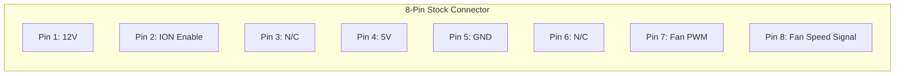
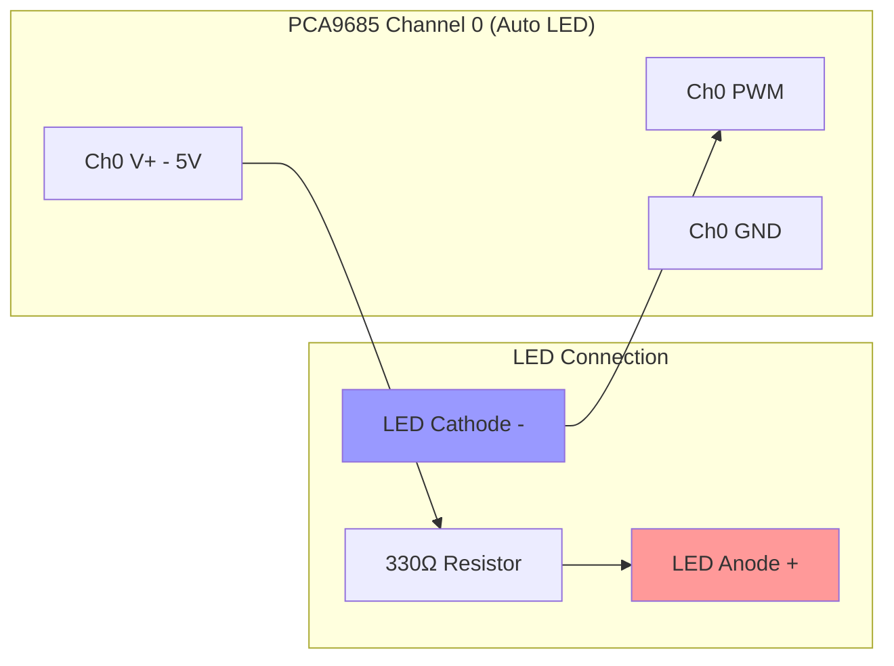

# Winix WAC6300 Smart Air Purifier Retrofit

Transform your Winix WAC6300 air purifier into a smart home device with full Home Assistant integration while maintaining all original functionality.

## ⚠️ SAFETY WARNING ⚠️

**HIGH VOLTAGE HAZARD - RISK OF DEATH OR SERIOUS INJURY**

The Winix WAC6300 power supply contains:
- **330VDC** for the fan motor
- **120VAC** mains voltage
- High voltage capacitors that may retain charge even when unplugged

### Safety Precautions:
- **ALWAYS UNPLUG** the unit and wait 10 minutes before working on it
- **NEVER** open or modify the power supply module
- **ONLY** work on the control PCB replacement as described
- The 8-pin connector carries only 5V and 12V, but the cable comes from the high voltage power supply - handle with care
- Keep the power supply module closed - it contains lethal voltages
- Work with one hand when possible to avoid current path across the heart
- Use insulated tools
- Never work on the device while powered
- If you're not comfortable working near high voltage equipment, seek professional help

**This modification involves working near high voltage components. Improper handling can result in electric shock, fire, or death. Proceed at your own risk.**

## Features

### 🏠 Smart Home Integration
- **Full Home Assistant control** via ESPHome
- WiFi connectivity with OTA updates
- Real-time status monitoring and control
- Filter life tracking with notifications
- Energy monitoring through fan feedback

### 🎛️ Original Functions Preserved
- All 4 original fan speeds (20%, 28%, 38%, 54%)
- Mode button with speed cycling
- Power button with on/off control
- Filter reset functionality
- Ionizer control
- All LED indicators

### ✨ Enhanced Features
- **Smart Power Button**: Always turns on to last used speed (never just "off")
- **Long Press Controls**: 
  - Power button: Dim/restore all LEDs
  - Mode button: Toggle ionizer
  - Filter reset: Reset both filter timers with visual feedback
- **Sleep Mode**: Automatically dims LEDs to 25% brightness
- **Filter Tracking**: 
  - Carbon filter: 90-day lifetime
  - HEPA filter: 365-day lifetime
  - Automatic notifications when replacement needed
- **Progressive Speed LEDs**: Visual indication shows current speed level
- **Custom Speed Control**: Set any speed from 0-100% via Home Assistant

### 🚧 Features Not Yet Implemented
The following features from the original Winix WAC6300 are not currently implemented in this retrofit but are planned for future development:

- **Buzzer/Beeper**: Audio feedback for button presses and alerts
- **IR Remote Receiver**: Support for the original infrared remote control
- **Air Quality Filter**: Automatic fan speed adjustment based on air quality sensors

These features may be added in future versions of the project.

## Hardware Requirements

- ESP32-C6 Supermini development board
- PCA9685 16-channel PWM controller
- Level shifter (3.3V to 5V) for fan PWM signal
- Voltage divider for fan feedback signal
- 5V power supply (can use from original board)
- Connecting wires and connectors

## Wiring Diagram

### Stock Connector Pinout


### ESP32-C6 Connections

```mermaid
graph TB
    subgraph "ESP32-C6"
        ESP_3V3[3.3V Power]
        ESP_5V[5V Power]
        ESP_GND[GND]
        GPIO0[GPIO0 - Level Shifter OE]
        GPIO1[GPIO1 - Fan PWM Out]
        GPIO2[GPIO2 - ION Enable]
        GPIO3[GPIO3 - Mode Button]
        GPIO4[GPIO4 - Filter Reset Button]
        GPIO6[GPIO6 - Fan Feedback ADC]
        GPIO7[GPIO7 - Power Button]
        GPIO8[GPIO8 - RGB Status LED]
        GPIO14[GPIO14 - I2C SDA]
        GPIO15[GPIO15 - I2C SCL]
        GPIO18[GPIO18 - PCA9685 OE]
    end
    
    subgraph "Level Shifter (8-Channel)"
        subgraph "Side A (3.3V)"
            VA[VA - 3.3V]
            GND_A[GND]
            A1[A1 - Fan PWM Out]
            A2[A2 - ION Enable Out]
            A3[A3 - Fan Feedback In]
            OE_A[OE - Enable]
        end
        subgraph "Side B (5V)"
            VB[VB - 5V]
            GND_B[GND]
            B1[B1 - Fan PWM to Stock]
            B2[B2 - ION to Stock]
            B3[B3 - Fan Feedback from Stock]
        end
    end
    
    subgraph "Stock Connector"
        SC2[Pin 2: ION Enable - 5V]
        SC4[Pin 4: 5V Power]
        SC5[Pin 5: GND]
        SC7[Pin 7: Fan PWM - 5V]
        SC8[Pin 8: Fan Speed - 5V]
    end
    
    subgraph "Buttons"
        BTN_MODE[Mode Button]
        BTN_FILTER[Filter Reset Button]
        BTN_POWER[Power Button]
    end
    
    subgraph "Status LED"
        WS2812[WS2812 RGB LED]
    end
    
    %% Power connections
    ESP_3V3 --> VA
    ESP_GND --> GND_A
    SC4 --> VB
    SC4 --> ESP_5V
    SC5 --> GND_B
    SC5 --> ESP_GND
    
    %% Signal connections
    GPIO0 --> OE_A
    GPIO1 --> A1
    GPIO2 --> A2
    GPIO6 --> A3
    
    %% Level shifter to stock connector
    B1 --> SC7
    B2 --> SC2
    SC8 --> B3
    
    %% Button connections (active low with pullups)
    BTN_MODE --> GPIO3
    BTN_FILTER --> GPIO4
    BTN_POWER --> GPIO7
    GPIO3 --> ESP_GND
    GPIO4 --> ESP_GND
    GPIO7 --> ESP_GND
    
    %% LED connection
    GPIO8 --> WS2812
    
    %% Direct connections to PCA9685
    subgraph "PCA9685 PWM Controller"
        PCA_SDA[SDA Pin]
        PCA_SCL[SCL Pin]
        PCA_OE[OE Pin]
    end
    
    GPIO14 --> PCA_SDA
    GPIO15 --> PCA_SCL
    GPIO18 --> PCA_OE
    
    style A1 fill:#9f9
    style A2 fill:#9f9
    style A3 fill:#99f
    style B1 fill:#9f9
    style B2 fill:#9f9
    style B3 fill:#99f
    style GPIO3 fill:#ffa
    style GPIO4 fill:#ffa
    style GPIO7 fill:#ffa
    style GPIO14 fill:#aaf
    style GPIO15 fill:#aaf
    style GPIO18 fill:#aaf
```


### PCA9685 Board Connections

```mermaid
graph TB
    subgraph "ESP32-C6"
        ESP_3V3[3.3V]
        ESP_5V[5V]
        ESP_GND[GND]
        ESP_SDA[GPIO14 - I2C SDA]
        ESP_SCL[GPIO15 - I2C SCL]
        ESP_OE[GPIO18 - PCA9685 OE]
    end
    
    subgraph "PCA9685 Board"
        subgraph "Control Header"
            PCA_VCC[VCC - 3.3V Logic]
            PCA_V[V+ - 5V LED Power]
            PCA_GND[GND]
            PCA_SDA[SDA]
            PCA_SCL[SCL]
            PCA_OE[OE - Output Enable]
        end
        
        subgraph "LED Channels"
            CH0[Ch0 - Auto Mode LED]
            CH1[Ch1 - Sleep Mode LED]
            CH2[Ch2 - Filter Change LED]
            CH3[Ch3 - Odor Level 5]
            CH4[Ch4 - Odor Level 4]
            CH5[Ch5 - Odor Level 3]
            CH6[Ch6 - Odor Level 2]
            CH7[Ch7 - Odor Level 1]
            CH8[Ch8 - Ion LED Primary]
            CH9[Ch9 - Speed 1 LED]
            CH10[Ch10 - Speed 2 LED]
            CH11[Ch11 - Speed 3 LED]
            CH12[Ch12 - Speed 4 LED]
            CH13[Ch13 - Speed 5 LED]
            CH14[Ch14 - Ion LED 2]
            CH15[Ch15 - Ion LED 3]
        end
    end
    
    subgraph "LEDs"
        AUTO_LED[Auto Mode LED]
        SLEEP_LED[Sleep Mode LED]
        FILTER_LED[Filter Change LED]
        ODOR_LEDS[Odor Level LEDs 1-5]
        SPEED_LEDS[Speed LEDs 1-5]
        ION_LEDS[Ion LEDs x3]
    end
    
    %% Power and control connections
    ESP_3V3 --> PCA_VCC
    ESP_5V --> PCA_V
    ESP_GND --> PCA_GND
    ESP_SDA --> PCA_SDA
    ESP_SCL --> PCA_SCL
    ESP_OE --> PCA_OE
    
    %% LED connections (cathode to PWM, anode to V+ via resistor)
    CH0 --> AUTO_LED
    CH1 --> SLEEP_LED
    CH2 --> FILTER_LED
    CH3 --> ODOR_LEDS
    CH4 --> ODOR_LEDS
    CH5 --> ODOR_LEDS
    CH6 --> ODOR_LEDS
    CH7 --> ODOR_LEDS
    CH8 --> ION_LEDS
    CH9 --> SPEED_LEDS
    CH10 --> SPEED_LEDS
    CH11 --> SPEED_LEDS
    CH12 --> SPEED_LEDS
    CH13 --> SPEED_LEDS
    CH14 --> ION_LEDS
    CH15 --> ION_LEDS
    
    style CH0 fill:#9f9
    style CH1 fill:#9f9
    style CH2 fill:#f99
    style CH8 fill:#99f
    style CH14 fill:#99f
    style CH15 fill:#99f
```


### LED Wiring Example


## Installation

### ⚡ Electrical Safety First
1. **UNPLUG the air purifier** from the wall outlet
2. **Wait 10 minutes** for capacitors to discharge
3. **Never touch or open the power supply board** - it contains lethal voltages
4. **Only disconnect the 8-pin connector** from the original control board
5. **Handle the connector carefully** - while it only carries 5V/12V, the cable originates from the high voltage power supply

### 1. Hardware Setup

1. **Prepare the ESP32-C6**
   - Flash the ESPHome configuration
   - Solder headers if needed

2. **Connect Level Shifter**
   - Side A (3.3V side):
     - VA → ESP32 3.3V
     - A1 → GPIO1 (Fan PWM output)
     - A2 → GPIO2 (ION enable output)
     - A3 → GPIO6 (Fan feedback input)
     - OE → GPIO0 (Output Enable)
   - Side B (5V side):
     - VB → 5V from stock connector
     - B1 → Stock Pin 7 (Fan PWM)
     - B2 → Stock Pin 2 (ION Enable)
     - B3 → Stock Pin 8 (Fan Speed Signal)

3. **Connect PCA9685**
   - Connect I2C lines (SDA to GPIO14, SCL to GPIO15)
   - Connect OE pin to GPIO18
   - Supply 3.3V to VCC, 5V to V+
   - Connect all LED cathodes to PWM channels as per diagram

4. **Connect Stock Connector**
   - All 5V signals go through level shifter
   - 5V (Pin 4) → Board power and level shifter VB
   - GND (Pin 5) → Board ground

5. **Connect Buttons**
   - Power button → GPIO7 (active low)
   - Mode button → GPIO3 (active low)
   - Filter reset → GPIO4 (active low)

### 2. Software Configuration

1. **Install ESPHome**
   ```bash
   pip install esphome
   ```

2. **Configure WiFi**
   Update the WiFi credentials in your common configuration files

3. **Flash the Device**
   ```bash
   esphome run thread-winix-livingroom.yaml
   ```

## Usage

### Physical Controls

| Button | Short Press | Long Press (1s) | Long Press (3s) |
|--------|------------|----------------|-----------------|
| Power | Toggle fan on/off | Dim/restore all LEDs | - |
| Mode | Cycle through speeds | Toggle ionizer | - |
| Filter Reset | Clear filter LED | - | Reset both filter timers |

### Speed Settings
- **Speed 1**: 20% PWM (Low)
- **Speed 2**: 28% PWM (Medium-Low)
- **Speed 3**: 38% PWM (Medium-High)  
- **Speed 4**: 54% PWM (High)
- **Sleep Mode**: 10% PWM (Ultra quiet, LEDs dimmed to 25%)

### LED Indicators

#### Speed LEDs (Progressive)
- Speed 1: LED 1 on
- Speed 2: LEDs 1-2 on
- Speed 3: LEDs 1-3 on
- Speed 4: LEDs 1-5 on (all speed LEDs)

#### Mode LEDs
- **Auto**: Automatic operation mode
- **Sleep**: Sleep mode active (dims all LEDs)
- **Filter**: Needs filter replacement
- **Ion**: Ionizer active (3 LEDs light together)

#### Odor Level Display
- Shows air quality on scale of 1-5 LEDs

### Home Assistant Integration

The device exposes these entities:

#### Controls
- `fan.air_purifier_fan` - Main fan control with speed
- `switch.ionizer` - Ionizer on/off
- `switch.auto_mode` - Auto mode
- `switch.sleep_mode` - Sleep mode (auto-dims LEDs)
- `switch.led_display` - Turn all LEDs on/off
- `number.all_leds_brightness` - Global LED brightness (0-100%)
- `number.odor_level_display` - Set odor level display (0-5)
- `select.preset_speeds` - Quick speed presets

#### Sensors
- `sensor.fan_status` - Fan feedback percentage
- `sensor.carbon_filter_life` - Carbon filter remaining (%)
- `sensor.hepa_filter_life` - HEPA filter remaining (%)
- `sensor.carbon_filter_days_remaining` - Days until replacement
- `sensor.hepa_filter_days_remaining` - Days until replacement
- `binary_sensor.carbon_filter_needs_replacement` - Alert when expired
- `binary_sensor.hepa_filter_needs_replacement` - Alert when expired

#### Actions
- `button.reset_carbon_filter` - Reset carbon filter timer
- `button.reset_hepa_filter` - Reset HEPA filter timer

### Example Automations

#### Filter Replacement Notification
```yaml
automation:
  - alias: "Notify Carbon Filter Replacement"
    trigger:
      - platform: state
        entity_id: binary_sensor.carbon_filter_needs_replacement
        to: "on"
    action:
      - service: notify.mobile_app
        data:
          title: "Air Purifier Maintenance"
          message: "Carbon filter needs replacement!"
          data:
            actions:
              - action: "RESET_CARBON"
                title: "Reset Timer"
```

#### Auto Sleep Mode
```yaml
automation:
  - alias: "Air Purifier Night Mode"
    trigger:
      - platform: time
        at: "22:00:00"
    action:
      - service: switch.turn_on
        entity_id: switch.sleep_mode
```

#### Air Quality Response
```yaml
automation:
  - alias: "Increase Speed on Poor Air Quality"
    trigger:
      - platform: numeric_state
        entity_id: sensor.air_quality_pm25
        above: 50
    action:
      - service: fan.set_percentage
        entity_id: fan.air_purifier_fan
        data:
          percentage: 75
```

## Troubleshooting

### LEDs not working
1. Check I2C connections (SDA/SCL)
2. Verify PCA9685 OE pin is connected to GPIO18
3. Check PCA9685 is getting 5V power
4. Run I2C scan to verify address (default 0x40)

### Fan not responding
1. Verify level shifter is powered and OE connected
2. Check fan PWM frequency (should be 4kHz)
3. Measure voltage at fan PWM pin (should vary with speed)

### Buttons not working
1. Ensure buttons connect to ground when pressed
2. Check internal pullups are enabled
3. Verify GPIO assignments match your wiring

### Filter timers not working
1. Timers only count when fan is running
2. Check ESP32 is maintaining time properly
3. Verify global variables are set to restore_value: yes

## Development Notes

### Measured Values from Stock PCB
- PWM Frequency: 3.910kHz
- Fan Feedback Voltages:
  - Level 1: 0.500V @ 22% duty
  - Level 2: 0.810V @ 28% duty
  - Level 3: 1.131V @ 38% duty
  - Level 4: 2.000V @ 56% duty

### Implementation Details
- Uses 4kHz PWM (close to stock 3.91kHz)
- Duty cycles: 20%, 28%, 38%, 54% (optimized from measurements)
- All LEDs use 1kHz PWM for smooth dimming
- Transition effects on LEDs for professional appearance

## Contributing

Feel free to submit issues and enhancement requests!

## License

This project is provided as-is for educational and personal use. Use at your own risk when modifying electrical appliances.

## Acknowledgments

- ESPHome team for the amazing platform
- Home Assistant community
- Original Winix engineers for a great air purifier design
